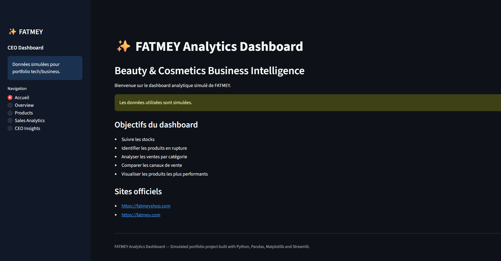
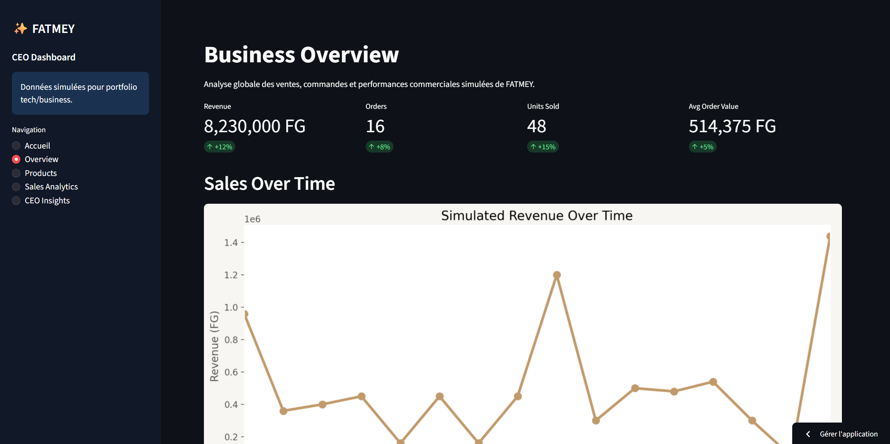
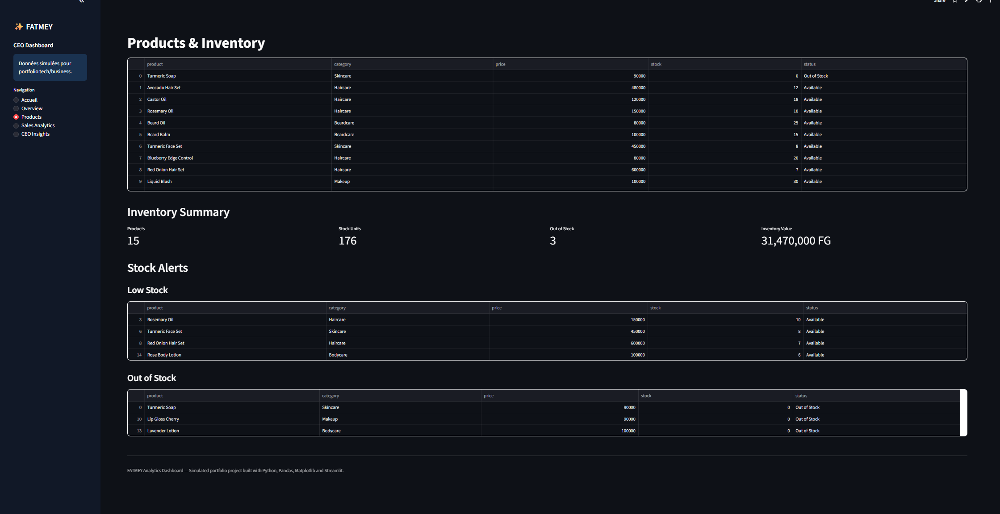
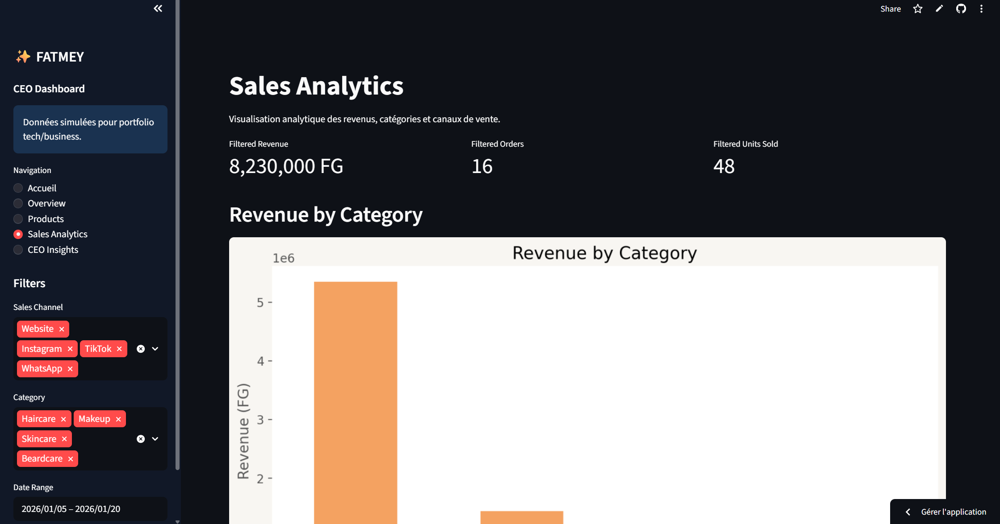
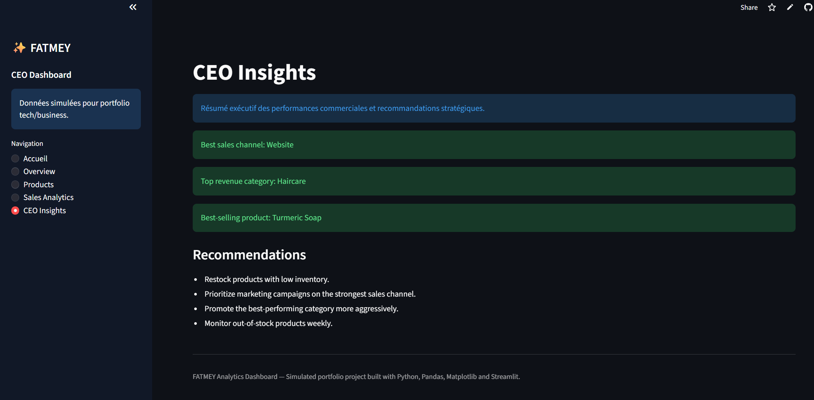

\# ✨ FATMEY Analytics Dashboard

Premium business intelligence dashboard built with Python, Pandas, Matplotlib and Streamlit.

\---

\# 🌍 Live Demo

https://fatmey-sales-dashboard-m7mcawmrfye57enjyfucud.streamlit.app

\---

\# 📌 Features

\- Multi-page analytics dashboard

\- Business KPIs

\- Inventory management

\- Sales analytics

\- CEO insights

\- Dynamic filters

\- Interactive charts

\- Premium dark UI

\---

\# 🛠 Technologies Used

\- Python

\- Pandas

\- Streamlit

\- Matplotlib

\---

\# 📸 Dashboard Preview

\## 🏠 Accueil

\---

\## 📊 Overview

\---

\## 📦 Products \& Inventory

\---

\## 📈 Sales Analytics

\---

\## 🧠 CEO Insights

\---

\# 📊 Dashboard Sections

\### Accueil

Presentation of the FATMEY analytics platform.

\### Overview

Global KPIs and revenue evolution.

\### Products

Inventory management and stock alerts.

\### Sales Analytics

Revenue analysis by category and sales channel.

\### CEO Insights

Strategic recommendations and business intelligence summary.

\---

\# ⚠️ Disclaimer

This project uses simulated business data for educational and portfolio purposes only.

\---

\# 👩🏾‍💻 Author

Mariame Cisse

\- https://fatmeyshop.com

\- https://fatmey.com

